[](https://github.com/mastodon-sc/mastodon-deep-lineage/actions/workflows/build.yml)
[](https://opensource.org/licenses/BSD-2-Clause)
[](https://sonarcloud.io/summary/overall?id=mastodon-sc_mastodon-deep-lineage)
[](https://sonarcloud.io/summary/overall?id=mastodon-sc_mastodon-deep-lineage)
[](https://zenodo.org/doi/10.5281/zenodo.10262664)
[](https://www.youtube.com/watch?v=774VE5h15i4&list=PL0D04vXRhSYGK9kmAFsIaUx72ujVRWUUs)

# Mastodon Deep Lineage - a collection of plugins to analyse lineages of tracked objects in Mastodon

## Table of Contents

* [Documentation of Mastodon](#documentation-of-mastodon)
* [Installation Instructions](#installation-instructions)
* [Numerical Features added to Mastodon](#numerical-features-added-to-mastodon)
  * [Spot Features](#spot-features)
  * [Branch Features](#branch-features)
* [Lineage Tree Classification](#lineage-tree-classification)
  * [Parameters](#parameters)
  * [Example](#example)
* [Exports](#exports)
  * [Label Image Exporter](#label-image-exporter)
  * [GraphML Exporter](#graphml-exporter)
* [Maintainer](#maintainer)
* [Contributors](#contributors)
* [License](#license)
* [Contribute Code or Provide Feedback](#contribute-code-or-provide-feedback)
* [Contribute Documentation](#contribute-documentation)
* [Acknowledgements](#acknowledgements)

## Documentation of Mastodon

[mastodon.readthedocs.io](https://mastodon.readthedocs.io/en/latest/index.html)

## Installation Instructions

* Add the listed Mastodon update site in Fiji:
  * Help > Update > Manage update sites
    * Name: Mastodon
    * 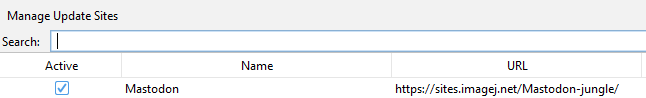
* Add the unlisted Mastodon Deep Lineage update site in Fiji:
  * Help > Update > Manage update sites > Add Unlisted Site
    * Name: Mastodon-DeepLineage
    * URL: https://sites.imagej.net/Mastodon-DeepLineage/
    * 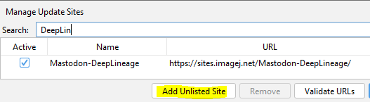

## Numerical Features added to Mastodon

### Spot Features

| **Feature name**             | **Projections**                                   | **Description**                                                                                                                                                                           | **Formula/Visualisation**                                                                                              |
|------------------------------|---------------------------------------------------|-------------------------------------------------------------------------------------------------------------------------------------------------------------------------------------------|------------------------------------------------------------------------------------------------------------------------|
| Spot Ellipsoid               | Short semi axes, Middle semi axis, Long semi axis | The ellipsoid semi axes in ascending order of length.                                                                                                                                     | The semi axes are computed applying the square root to the eigenvalues of the so-called covariance matrix of the spots |
|                              | Volume                                            | The volume of the ellipsoid.                                                                                                                                                              | $V=\frac{4}{3} \pi a b c$                                                                                              |
| Spot Ellipsoid Aspect Ratios | Aspect ratio short to middle                      | The ratio between the short axis and middle axis.                                                                                                                                         | $\frac{\text{short axis}}{\text{middle axis}}$                                                                         |
|                              | Aspect ratio short to long                        | The ratio between the short axis and long axis.                                                                                                                                           | $\frac{\text{short axis}}{\text{long axis}}$                                                                           |
|                              | Aspect ratio middle to long                       | The ratio between the middle axis and long axis.                                                                                                                                          | $\frac{\text{middle axis}}{\text{long axis}}$                                                                          |
| Spot Branch ID               | _idem_                                            | The ID of the branch spot each spot belongs to.                                                                                                                                           |                                                                                                                        |
| Spot Relative Movement*      | x, y and z component                              | The x, y and z components of the movement distance of a spot relative to its `n` nearest neighbors. The number of neighbors to be considered can be specified by the users. Default is 5. |                                                       |
|                              | distance                                          | The movement distance relative to `n` nearest neighbors.                                                                                                                                  |                                                       |

### Branch Features

| **Feature name**                     | **Projections** | **Description**                                                                                                                                                                                                                                                                         | **Formula/Visualisation**                                                                                                                           |
|--------------------------------------|-----------------|-----------------------------------------------------------------------------------------------------------------------------------------------------------------------------------------------------------------------------------------------------------------------------------------|-----------------------------------------------------------------------------------------------------------------------------------------------------|
| Branch N Leaves                      | _idem_          | The total number of leaves of a branch spot in the whole track subtree of this branch spot.                                                                                                                                                                                             |                                                                                                    |
| Branch N Successors and Predecessors | _idem_          | Total number of successors and predecessors of a branch spot in the whole track subtree of this branch spot.                                                                                                                                                                            |                                                                                    |
| Branch Sinuosity                     | _idem_          | The sinuosity of a spot during its life cycle (cf. [Sinuosity](https://en.wikipedia.org/wiki/Sinuosity)), i.e. how much the track represented by the branch is curved. Values close to 1: almost straight movement. Values significantly higher than 1: winding or meandering movement. |                                                                                                |
| Branch Average Movement              | _idem_          | The average movement per frame of a spot during its life cycle.                                                                                                                                                                                                                         |  <br><br> e.g.: <br><br>  |
| Branch Movement Direction            | _idem_          | The movement direction of a branch spot represented as a normalized directional vector pointing from the start (spot) position to the end (spot) position of the BranchSpot.                                                                                                            |                                                                                  |
| Branch Cell Division Frequency       | _idem_          | Number of cell divisions in the subtree rooted at each Branch-spot divided by total duration of branches in this sub-tree                                                                                                                                                               |                                                                                      |
| Branch Relative Movement*            | x, y and z component | The x, y and z components of the average speed of a spot during its life cycle relative to its `n` nearest neighbors. The number of neighbors to be considered can be specified by the users. Default is 5.                                                                             |                                                                                                                                                                              |
|                                      | average speed        | The average speed of a spot during its life cycle relative to its `n` nearest neighbors.                                                                                                                                                                                                |                                                                                                                                                                              |

'*' The relative movement features cannot be called from the FeatureComputer directly. Instead they are computed via the
plugin menu: 

## Lineage Tree Classification

* This plugin is capable of grouping similar lineage trees together.
* The similarity of a pair of lineage trees is computed based on the Zhang edit distance for unordered
  trees ([Zhang, K. Algorithmica 15, 205–222, 1996](https://doi.org/10.1007/BF01975866)). This method captures the cost
  of the transformation of one tree into the other.
* The cost function applied for the tree edit distance uses the attribute branch spot duration, which is computed as a
  difference of time points between to subsequent divisions reflecting the start and the end of a spot's lifetime.
* Thus, the linage classification operates on Mastodon's branch graph.
* The Zhang unordered edit distance allows the following edit operations:

```
  Note: The prefix T may represent a node or a complete subtree. Nodes without this prefix are just nodes.
  
  1. Change label
        A         A'
       / \  ->   / \
      TB TC     TB TC
  
  
  2a: Remove subtree (opposite of 2b)
         A         A
        / \   ->   |
       TB TC       TB
  
  2b: Add new subtree (opposite of 2a)
  
        A          A
        |    ->   / \
        TB       TB TC
  
  
  3a: Remove subtree but keep one child (opposite of 3b)
  
         A          A
        / \   ->   / \
       B  TC      TD TC
      / \
     TD TE        (remove B and TE, keep TD)
  
  3b: Convert existing subtree into child of a newly inserted subtree (opposite of 3a)
         A             A
        / \    ->     / \
       TB TC         D  TC
                    / \
                   TB TE       (insert D and TE, keep TB)
  
  
  4a: Remove subtree (and siblings) but keep all children (opposite of 4b)
         A               A
        / \             / \
       B  TC   ->      TD TE
      / \
     TD TE            (Subtree B and it's sibling TC are removed, but the children
                       of B namely TD and TE are kept)
  
  4b: Convert existing subtrees into children of a newly inserted subtree (opposite of 4a)
         A               A
        / \             / \
       TB TC   ->      D  TE
                      / \
                     TB TC       (Subtree D and it's sibling TE are newly inserted,
                                  TB and TC are kept as children of D)
```

* A basic example of the tree edit
  distance:

```
Tree1
	                        node1(node_weight=13)
	               ┌──────────┴─────────────┐
	               │                        │
	             node2(node_weight=203)   node3(node_weight=203)
```

```
Tree2
	                        node1(node_weight=12)
	               ┌──────────┴─────────────┐
	               │                        │
	             node2(node_weight=227)   node3(node_weight=227)
	                             ┌──────────┴─────────────┐
	                           node4(node_weight=10)    node5(node_weight=10)
```

* Edit distance of 69, because:

  * one node has a difference of 1
  * two nodes have a difference of 24 each
  * two extra nodes are added with a weight of 10 each
  * $\text{Zhang Tree Edit Distance}_{Tree1,Tree2} = 1 + 2 \times 24 + 2 \times 10 = 69$
* The tree edit distances are computed between all possible combinations of lineage trees leading to a two-dimensional
  matrix. The values in this matrix are considered to reflect similarities of lineage trees. Low tree edit distances
  represent a high similarity between a discrete pair of lineage trees.
* This similarity matrix is then used to perform
  an [agglomerative hierarchical clustering](https://en.wikipedia.org/wiki/Hierarchical_clustering) into a specifiable
  number of classes.

### Parameters

* Crop criterion:
  * Time point (default)
  * Number of spots
* Crop start
* Crop end
* Number of classes (minimum 2)
* Minimum number of divisions
* Similarity measure:
  * Normalized Zhang Tree Edit Distance (default). $\frac{distance_{treeA,treeB}}{distance_{treeA,emptyTree} +
    distance_
    {treeB,emptyTree}}$
  * Per Branch Spot Zhang Tree Edit Distance. $\frac{distance_{treeA,treeB}}{numBranchSpotsA + numBranchSpotsB}$
  * Zhang Tree Edit Distance as described in ([Zhang](https://doi.org/10.1007/BF01975866)).
* Linkage strategy for hierarchical clustering,
  cf. [linkage methods](https://en.wikipedia.org/wiki/Hierarchical_clustering#Cluster_Linkage)
  * Average (default)
  * Single
  * Complete
* Feature:
  * Branch duration (default and currently only selectable feature)
* Show dendrogram of clustering

### Example

* Demo data: [Example data set](doc/deep_lineage/lineage_classification/lineage_classification.mastodon)
  * The demo data does not contain any image data.
  * The spatial positions of the spots are randomly generated.
  * When opening the dataset, you should confirm that you open the project with dummy
    images. 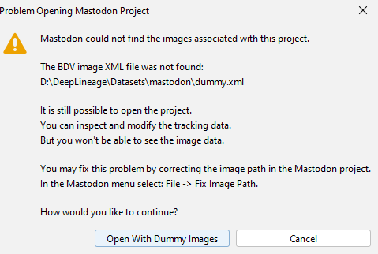
* The track scheme of the demo data containing 8 lineage tree in total. You may see that the "symmetric", the "
  asymmetric" and the "single division" trees look
  similar to each other, but dissimilar to the other
  trees. 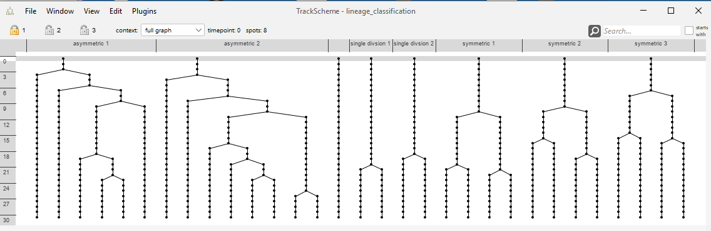
* The lineage classification dialog. 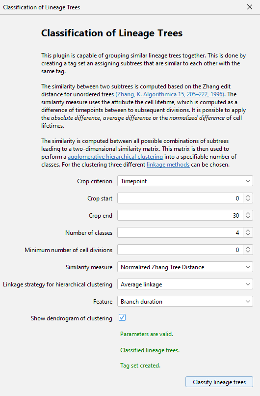
* The resulting dendrogram. 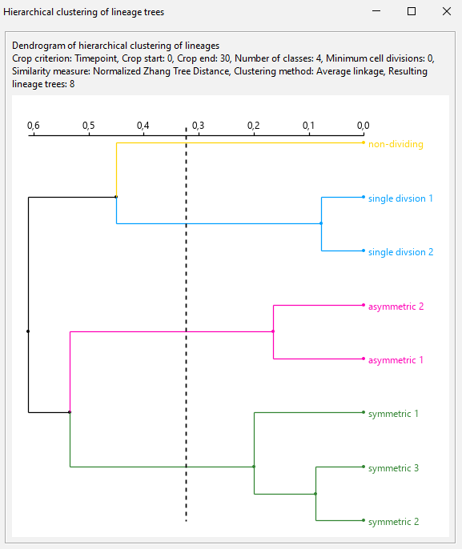
* The resulting tag set used for coloring the track
  scheme. 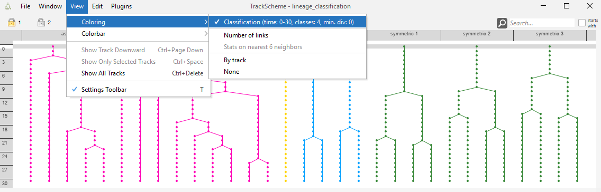
* The resulting tag set used for coloring the track scheme branch
  view. 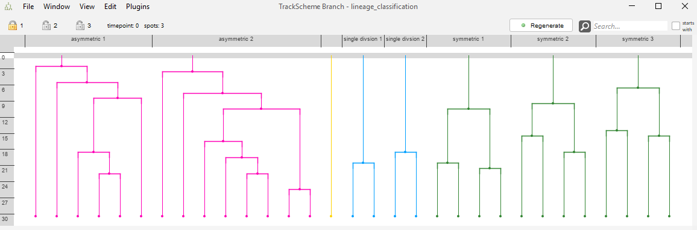

## Exports

### Label Image Exporter

* The Label image exporter is capable of saving a label image to a file using the existing ellipsoids in Mastodon.
* For the labels, the _spot ids_, _branch spot ids_ or the _track ids_ that correspond to the spots / ellipsoids may be
  used. Since these Ids are counted zero based in Mastodon, an **offset of 1** is added to all Ids so that no label
  clashes with the background of zero.
* The recommended export format is '*.tif'-files. However, it should work also for other formats supported by ImageJ.
* The export uses an image with signed integer value space, thus the maximum allowed id is 2.147.483.646.
* Exporter can be found here:  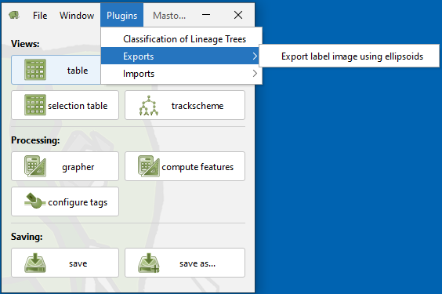
* The dialog:  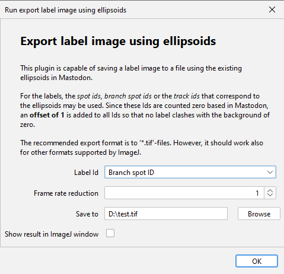

#### Parameters
  * Label Id: The id that is used for the labels. The default is the Spot track Id.
    * The ids correspond to the highlighted columns in the feature
      table: 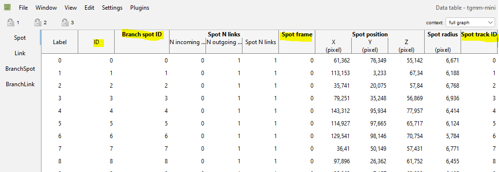
  * Frame rate reduction: Only export every n-th frame. 1 means no reduction. Value must be >= 1.
    * The frame number corresponds to the _Spot frame_ column in the feature table.
* Save to: Path to the file to save the label image to. Should end with '.tif'.

#### Example

* Demo data: [Example data set](https://github.com/mastodon-sc/mastodon-example-data/tree/master/tgmm-mini)
* The timelapse with the ellipsoids in
  BigDataViewer: 
* The exported tif imported into [Napari](https://napari.org/stable/) 3D
  view: 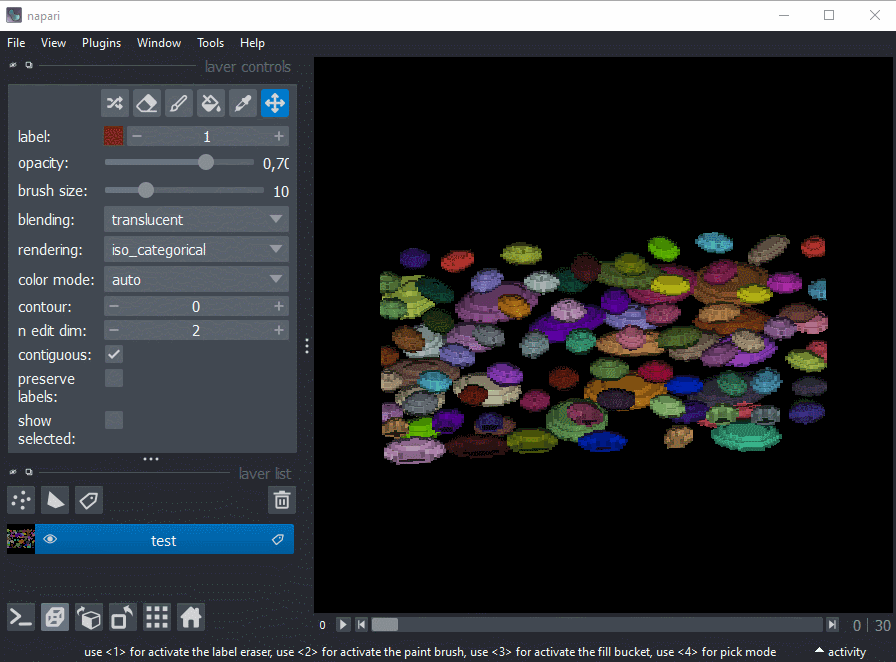

### GraphML Exporter

* Exports the branch graph to a [GraphML](http://graphml.graphdrawing.org/) file.
  * The graph is directed. The branch spots are the vertices and the branch links are the edges.
  * The vertices receive a label attribute with the branch spot name. The vertices receive a duration attribute with the
    branch duration.
  * The edges are not labeled and have no attributes.
* GraphML can be visualized with [Cytoscape](https://cytoscape.org/), [yEd](https://www.yworks.com/products/yed)
  or [Gephi](https://gephi.org/).
* GraphML can be processed in Java using the [JGraphT](https://jgrapht.org/) library.
* GraphML can be processed in Python using the [NetworkX](https://networkx.org/) library.
* Exporter can be found here:  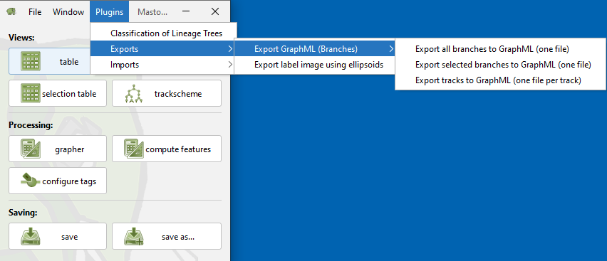

#### Options

* Export all branches to GraphML (one file)
  * Exports the whole branch graph to a single file.
  * Select a file to save to. Should end with '.graphml'.
* Export selected branches to GraphML (one file)
  * Exports the selected branches to a single file.
    * The selected branches are the ones that are highlighted in the branch view.
    * A branch is considered selected if at least one of its spots is selected. However, the exported duration attribute
      always reflects the whole branch duration.
  * Select a file to save to. Should end with '.graphml'.
* Export tracks to GraphML (one file per track)
  * Exports each track to a separate file.
  * Select a directory to save to.

#### Example

* Demo data: [Example data set](https://github.com/mastodon-sc/mastodon-example-data/tree/master/tgmm-mini)
* The resulting file loaded into yEd: 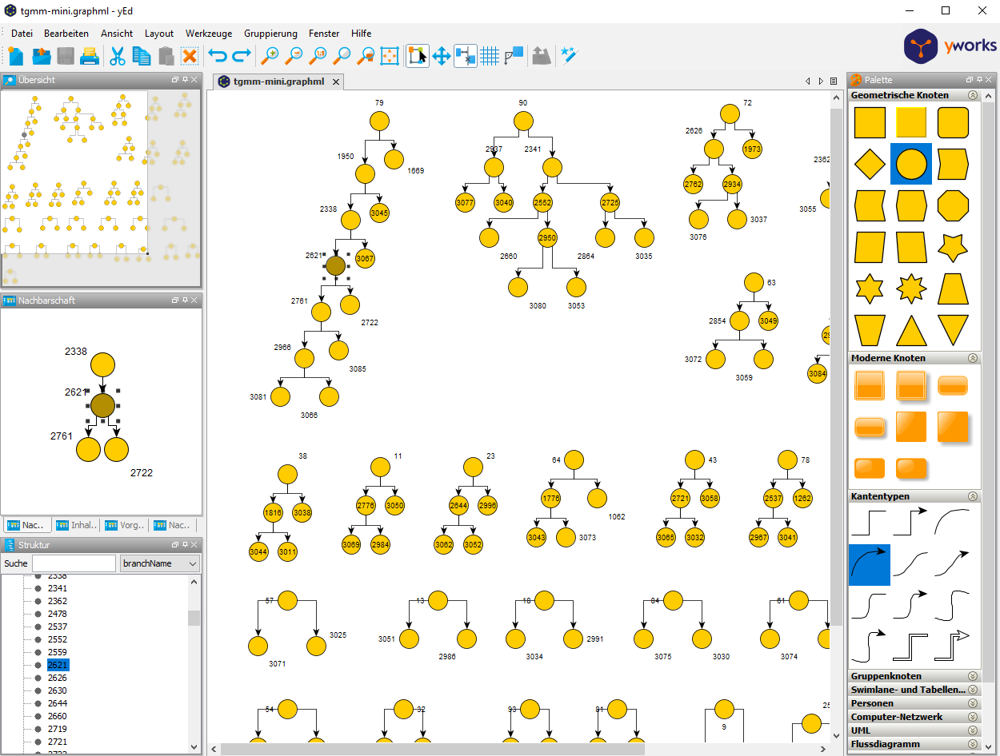
* The resulting file loaded into Cytoscape: 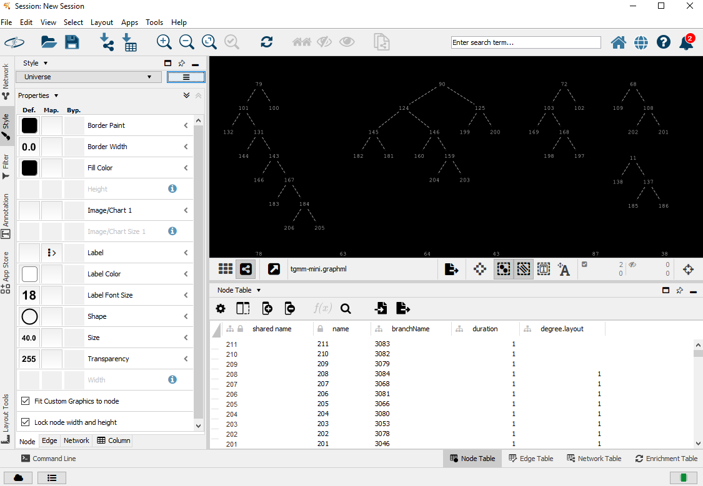

## Maintainer

* [Stefan Hahmann](https://github.com/stefanhahmann/)

## Contributors

* [Matthias Arzt](https://github.com/maarzt/)

## License

* [BSD 2-Clause License](https://opensource.org/license/bsd-2-clause/)

## Contribute Code or Provide Feedback

* You are welcome to submit Pull Requests to this repository. This repository runs code analyses on
  every Pull Request using [SonarCloud](https://sonarcloud.io/dashboard?id=mastodon-sc_mastodon-deep-lineage).
* Please read the [general advice](https://github.com/mastodon-sc/) re contributing to Mastodon and its plugins.

## Contribute Documentation

* If you would like to contribute to this documentation, feel free to open a pull request. The documentation is written
  in Markdown format.

## Acknowledgements

* The development of this plugin was supported by the [DFG](https://www.dfg.de/en/) under
  grant [490966236](https://gepris.dfg.de/gepris/projekt/490966236) and the [ANR](https://anr.fr/en/) under
  grant [ANR-21-CE13-0044](https://anr.fr/Project-ANR-21-CE13-0044).
