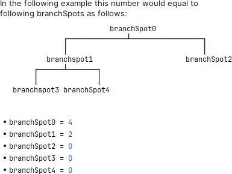
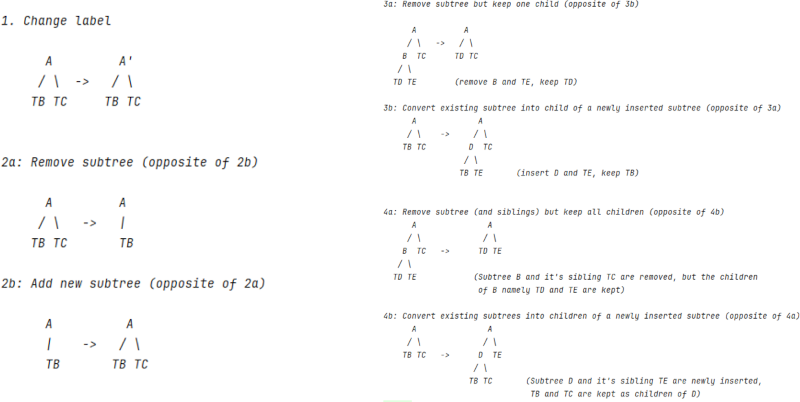
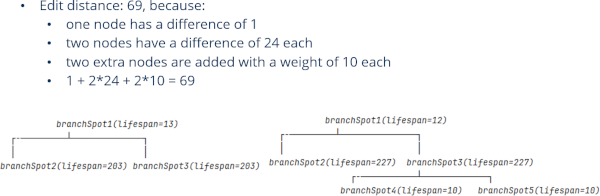
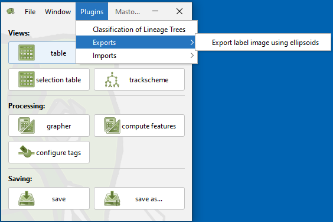
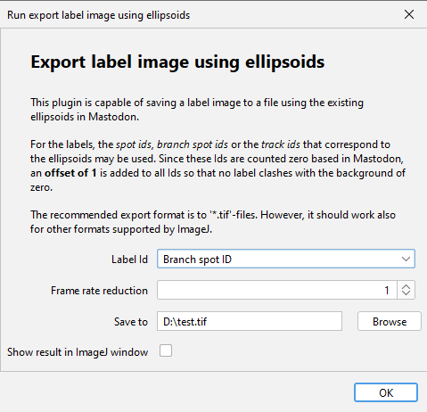
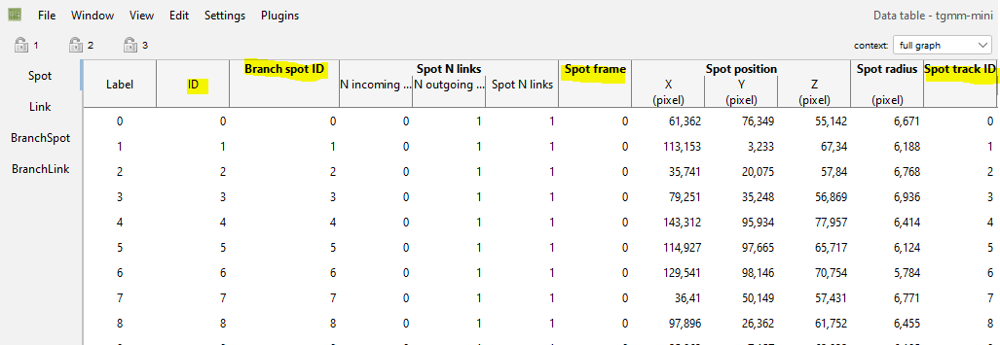
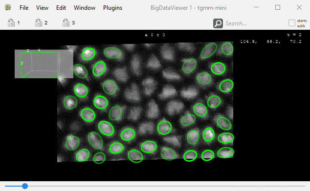
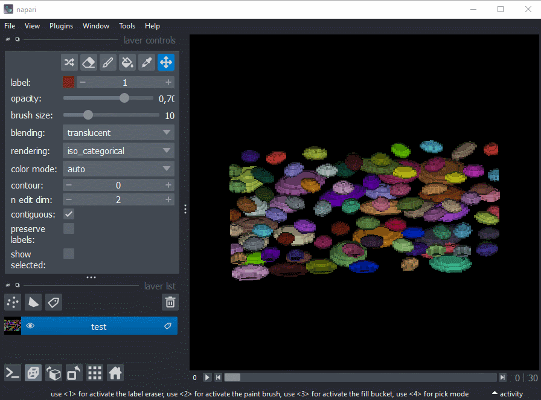

# Mastodon Deep Lineage - a collection of plugins to analyse lineages of tracked objects in Mastodon

## Documentation of Mastodon

[mastodon.readthedocs.io](https://mastodon.readthedocs.io/en/latest/index.html)

## Installation instructions

## Numerical Features added to Mastodon

### Spot Features

| **Feature name**             | **Projections**                                   | **Description**                                       | **Formula**                                                                                                            |
|------------------------------|---------------------------------------------------|-------------------------------------------------------|------------------------------------------------------------------------------------------------------------------------|
| Spot Ellipsoid               | Short semi axes, Middle semi axis, Long semi axis | The ellipsoid semi axes in ascending order of length. | The semi axes are computed applying the square root to the eigenvalues of the so-called covariance matrix of the spots |
|                              | Volume                                            | The volume of the ellipsoid.                          | $V=\frac{4}{3} \pi a b c$                                                                                              |
| Spot Ellipsoid Aspect Ratios | Aspect ratio short to middle                      | The ratio between the short axis and middle axis.     | $\frac{\text{short axis}}{\text{middle axis}}$                                                                         |
|                              | Aspect ratio short to long                        | The ratio between the short axis and long axis.       | $\frac{\text{short axis}}{\text{long axis}}$                                                                           |
|                              | Aspect ratio middle to long                       | The ratio between the middle axis and long axis.      | $\frac{\text{middle axis}}{\text{long axis}}$                                                                          |
| Spot Branch ID               | _idem_                                            | The ID of the branch spot each spot belongs to.       |                                                                                                                        |

### Branch-spot features.

| **Feature name**   | **Projections** | **Description**                                                                                                                                                                                                                                                                                 | **Formula**                                                                                                                          |
|--------------------|-----------------|-------------------------------------------------------------------------------------------------------------------------------------------------------------------------------------------------------------------------------------------------------------------------------------------------|--------------------------------------------------------------------------------------------------------------------------------------|
| Branch N leaves    | _idem_          | The total number of leaves of a branch spot in the whole track subtree of this branch spot.                                                                                                                                           |                                                                                                                                      |
| Branch N successor | _idem_          | Total number of successors of a branch spot in the whole track subtree of this branch spot.                                                                                                             |                                                                                                                                      |
| Branch Sinuosity   | _idem_          | Computes the sinuosity of a spot during its life cycle (cf. [Sinuosity](https://en.wikipedia.org/wiki/Sinuosity)), i.e. how much the track represented by the branch is curved Values close to 1: almost straight movement. Values significantly higher than 1: winding or meandering movement. | $\frac{\text{track length}}{\text{direct distance}}$, i.e.  |

## Lineage Tree Classification

* This plugin is capable of grouping similar lineage trees together.
* The similarity of a pair of lineage trees is computed based on the Zhang edit distance for unordered
  trees ([Zhang, K. Algorithmica 15, 205–222, 1996](https://doi.org/10.1007/BF01975866)). This method captures the cost
  of the transformation of one tree into the other.
* The cost function applied for the tree edit distance uses the attribute branch spot duration, which is computed as a
  difference of time points between to subsequent divisions reflecting the start and the end of a spot's lifetime.
* Thus, the linage classification operates on Mastodon's branch graph.
* Illustration of allowed
  transformations: 
* A basic example of the tree edit
  distance: 
* The similarity is computed between all possible combinations of lineage trees leading to a two-dimensional similarity
  matrix. This matrix is then used to perform
  an [agglomerative hierarchical clustering](https://en.wikipedia.org/wiki/Hierarchical_clustering) into a specifiable
  number of classes.

### Parameters:

* Crop criterion:
  * Time point (default)
  * Number of spots
* Crop start
* Crop end
* Number of classes (minimum 2)
* Minimum number of divisions
* Similarity measure:
  * Normalized Zhang Tree Edit Distance (default). $\frac{distance_{treeA,treeB}}{distance_{treeA,emptyTree} + distance_
    {treeB,emptyTree}}$
  * Per Branch Spot Zhang Tree Edit Distance. $\frac{distance_{treeA,treeB}}{numBranchSpotsA + numBranchSpotsB}$
  * Zhang Tree Edit Distance as described in ([Zhang](https://doi.org/10.1007/BF01975866)).
* Linkage strategy for hierarchical clustering,
  cf. [linkage methods](https://en.wikipedia.org/wiki/Hierarchical_clustering#Cluster_Linkage)
  * Average (default)
  * Single
  * Complete
* Feature:
  * Branch duration (default and currently only selectable feature)
* Show dendrogram of clustering

### Example:

* Demo data: [Example data set](doc/deep_lineage/lineage_classification/lineage_classification.mastodon)
  * The demo data does not contain any image data.
  * The spatial positions of the spots are randomly generated.
  * When opening the dataset, you should confirm that you open the project with dummy
    images. 
* The track scheme of the demo data containing 8 lineage tree in total. You may see that the "symmetric", the "
  asymmetric" and the "single division" trees look
  similar to each other, but dissimilar to the other
  trees. 
* The lineage classification dialog. 
* The resulting dendrogram. 
* The resulting tag set used for coloring the track
  scheme. 
* The resulting tag set used for coloring the track scheme branch
  view. 

## Label image exporter

* The Label image exporter is capable of saving a label image to a file using the existing ellipsoids in Mastodon.
* For the labels, the _spot ids_, _branch spot ids_ or the _track ids_ that correspond to the spots / ellipsoids may be
  used. Since these Ids are counted zero based in Mastodon, an **offset of 1** is added to all Ids so that no label
  clashes with the background of zero.
* The recommended export format is '*.tif'-files. However, it should work also for other formats supported by ImageJ.
* The export uses an image with signed integer value space, thus the maximum allowed id is 2.147.483.646.
* Exporter can be found here:  
* The dialog:  
  * Label Id: The id that is used for the labels. The default is the Spot track Id.
    * The ids correspond to the highlighted columns in the feature
      table: 
  * Frame rate reduction: Only export every n-th frame. 1 means no reduction. Value must be >= 1.
    * The frame number corresponds to the _Spot frame_ column in the feature table.
  * Save to: Path to the file to save the label image to.

### Example:

* Demo data: [Example data set](https://github.com/mastodon-sc/mastodon-example-data/tree/master/tgmm-mini)
* The timelapse with the ellipsoids in
  BigDataViewer: 
* The exported tif imported into [Napari](https://napari.org/stable/) 3D
  view: 

## Maintainer

* [Stefan Hahmann](https://github.com/stefanhahmann/)

## Contributors

* [Matthias Arzt](https://github.com/maarzt/)

## License

* [BSD 2-Clause License](LICENSE)

## Contribute Code or Provide Feedback

* You are welcome to submit Pull Requests to this repository. This repository runs code analyses on
  every Pull Request using [SonarCloud](https://sonarcloud.io/dashboard?id=mastodon-sc_mastodon-deep-lineage).
* Please read the [general advice](https://github.com/mastodon-sc/) re contributing to Mastodon and its plugins.

## Contribute Documentation

* If you would like to contribute to this documentation, feel free to open a pull request. The documentation is written
  in Markdown format.

## Acknowledgements

* The development of this plugin was supported by the [DFG](https://www.dfg.de/en/) under
  grant [490966236](https://gepris.dfg.de/gepris/projekt/490966236) and the [ANR](https://anr.fr/en/) under
  grant [ANR-21-CE13-0044](https://anr.fr/Project-ANR-21-CE13-0044).
