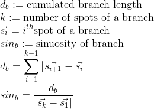
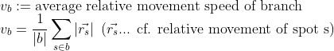
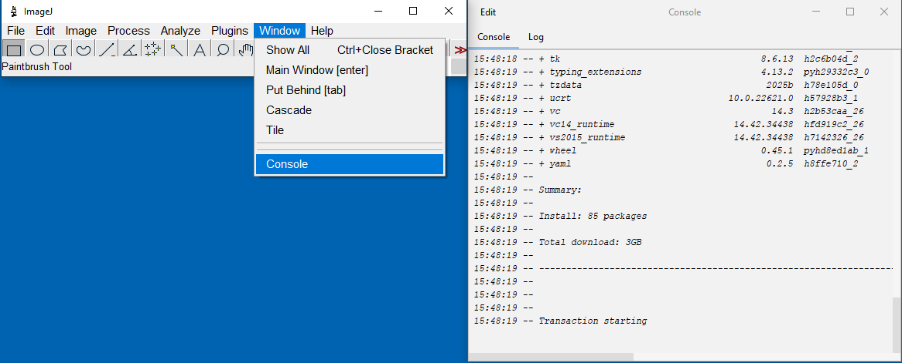
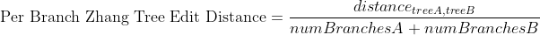

[](https://github.com/mastodon-sc/mastodon-deep-lineage/actions/workflows/build.yml)
[](https://opensource.org/licenses/BSD-2-Clause)
[](https://sonarcloud.io/summary/overall?id=mastodon-sc_mastodon-deep-lineage)
[](https://sonarcloud.io/summary/overall?id=mastodon-sc_mastodon-deep-lineage)
[](https://zenodo.org/doi/10.5281/zenodo.10262664)
[](https://www.youtube.com/playlist?list=PL0D04vXRhSYGK9kmAFsIaUx72ujVRWUUs)

# Mastodon Deep Lineage - a collection of plugins to analyse lineages of tracked objects in Mastodon

## Table of Contents

* [Documentation of Mastodon](#documentation-of-mastodon)
* [Installation Instructions](#installation-instructions)
* [Numerical Features added to Mastodon](#numerical-features-added-to-mastodon)
    * [Spot Features](#spot-features)
    * [Branch Features](#branch-features)
* [Detectors added to Mastodon](#detectors-added-to-mastodon)
    * [StarDist Detector](#stardist-detector)
    * [Cellpose3 Detector](#cellpose3-detector)
    * [Cellpose4 Detector](#cellpose4-detector)
  * [Which Cellpose version to use?](#which-cellpose-version-to-use)
  * [Examples of Deep-Learning Detectors](#examples-of-deep-learning-detectors)
* [Hierarchical Clustering of Lineage Trees](#hierarchical-clustering-of-lineage-trees)
    * [Zhang Tree Edit Distance](#zhang-tree-edit-distance)
    * [Workflow](#workflow)
    * [Parameters](#parameters)
    * [Example](#example)
* [Lineage Motif Search](#lineage-motif-search)
    * [Workflow](#workflow-1)
    * [Usage](#usage)
    * [Parameters](#parameters-1)
* [Dimensionality reduction](#dimensionality-reduction)
    * [Usage](#usage-1)
    * [Description](#description)
    * [Parameters](#parameters-2)
* [Import](#import)
    * [Import Spots from Segmented Label Image](#import-spots-from-segmented-label-image)
* [Export](#export)
    * [Label Image Exporter](#label-image-export)
    * [GraphML Export](#graphml-export)
* [Technical Information](#technical-information)
    * [Maintainer](#maintainer)
    * [Contributors](#contributors)
    * [License](#license)
    * [Contribute Code or Provide Feedback](#contribute-code-or-provide-feedback)
    * [Contribute Documentation](#contribute-documentation)
* [Acknowledgements](#acknowledgements)

## Documentation of Mastodon

Mastodon Deep Lineage is an extension of Mastodon. For the full documentation of Mastodon, please visit
[mastodon.readthedocs.io](https://mastodon.readthedocs.io/en/latest/index.html).

## Installation Instructions

* Add the listed Mastodon update sites in Fiji:
    * `Help > Update > Manage update sites`
        1. `Mastodon`
        2. `Mastodon-DeepLineage`
           

## Numerical Features added to Mastodon

### Spot Features

| **Feature name**             | **Projections**                                   | **Description**                                                                                                                                                                                                                                                                                                       | **Formula/Visualisation**                                                                                              |
|------------------------------|---------------------------------------------------|-----------------------------------------------------------------------------------------------------------------------------------------------------------------------------------------------------------------------------------------------------------------------------------------------------------------------|------------------------------------------------------------------------------------------------------------------------|
| Spot Ellipsoid               | Short semi axes, Middle semi axis, Long semi axis | The ellipsoid semi axes in ascending order of length.                                                                                                                                                                                                                                                                 | The semi axes are computed applying the square root to the eigenvalues of the so-called covariance matrix of the spots |
|                              | Volume                                            | The volume of the ellipsoid. <br><br> Example visualization:                                                                                                                                                                            |                                                                                   |
| Spot Ellipsoid Aspect Ratios | Aspect ratio short to middle                      | The ratio between the short axis and middle axis.                                                                                                                                                                                                                                                                     |                                                                          |
|                              | Aspect ratio short to long                        | The ratio between the short axis and long axis. <br><br> Example visualization:                                                                                                                                      |                                                                            |
|                              | Aspect ratio middle to long                       | The ratio between the middle axis and long axis.                                                                                                                                                                                                                                                                      |                                                                           |
| Spot Branch ID               | _idem_                                            | The ID of the branch spot each spot belongs to.                                                                                                                                                                                                                                                                       |                                                                                                                        |
| Spot Relative Movement*      | x, y and z component                              | The x, y and z components of the movement distance of a spot relative to its `n` nearest neighbors. The number of neighbors to be considered can be specified by the users. Default is 5. <br><br> Example visualization:  |                                                                |
|                              | distance                                          | The movement distance relative to `n` nearest neighbors. <br><br> Example visualization:                                                                                                                           |                                                                |

### Branch Features

| **Feature name**                     | **Projections**      | **Description**                                                                                                                                                                                                                                                                                                                                                                                                                                                                                                                                                              | **Formula/Visualisation**                                                                                                             |
|--------------------------------------|----------------------|------------------------------------------------------------------------------------------------------------------------------------------------------------------------------------------------------------------------------------------------------------------------------------------------------------------------------------------------------------------------------------------------------------------------------------------------------------------------------------------------------------------------------------------------------------------------------|---------------------------------------------------------------------------------------------------------------------------------------|
| Branch N Leaves                      | _idem_               | The total number of leaves of a branch spot in the whole track subtree of this branch spot. <br><br> Example visualization:                                                                                                                                                                                                                                                                                                                                                                     |                                                                                             |
| Branch N Successors and Predecessors | _idem_               | Total number of successors and predecessors of a branch spot in the whole track subtree of this branch spot. <br><br> Example visualization: <br> Successors (encodes reproductivity)  <br> Predecessors (encodes generation)                                                                                                                                                                  |                                                                             |
| Branch Start and End Timepoints      | _idem_               | The first timepoint and the last timepoint of a branch spot. <br><br> Example visualization: <br> First timepoint  <br> Last timepoint                                                                                                                                                                                                                                                                                       |                                                                             |
| Branch Sinuosity                     | _idem_               | The sinuosity of a spot during its life span (cf. [Sinuosity](https://en.wikipedia.org/wiki/Sinuosity)), i.e. how much the track represented by the branch is curved. Values close to 1: almost straight movement. Values significantly higher than 1: winding or meandering movement. Positive infinity (∞), if the spot is at the end at the same position as at the beginning, but has moved in between. <br><br> Example visualization:                                                 |                                                                                   |
| Branch Average Movement              | _idem_               | The average movement per frame of a spot during its life span. Example visualization:                                                                                                                                                                                                                                                                                                                                                                                           |  <br><br> e.g.: <br><br>  |
| Branch Movement Direction            | _idem_               | The movement direction of a branch spot represented as a normalized directional vector pointing from the start (spot) position to the end (spot) position of the BranchSpot. <br><br> Example visualizations: <br> x-component  <br> y-component  <br> z-component  |                                                                           |
| Branch Cell Division Frequency       | _idem_               | Number of cell divisions in the subtree rooted at each Branch-spot divided by total duration of branches in this sub-tree. <br><br> Example visualization:                                                                                                                                                                                                                                                                                                           |                                                                               |
| Branch Relative Movement*            | x, y and z component | The x, y and z components of the average speed of a spot during its life span relative to its `n` nearest neighbors. The number of neighbors to be considered can be specified by the users. Default is 5.                                                                                                                                                                                                                                                                                                                                                                   |                                                                           |
|                                      | average speed        | The average speed of a spot during its life span relative to its `n` nearest neighbors. <br><br> Example visualization:                                                                                                                                                                                                                                                                                                                                                       |                                                                           |

'*' The relative movement features cannot be called from the FeatureComputer directly. Instead, they can be accessed via
the plugin menu: `Plugins > Compute Features > Movement of spots relative to nearest neighbors`

## Detectors added to Mastodon

**It is highly recommended to use all detectors, added by Mastodon Deep Lineage, only on machines with a GPU (ideally
NVIDIA). The detectors are very slow on machines without a GPU. Moreover, consider running these detectors on a
workstation and not on a typical consumer machine for better performance.**

* When running (or even previewing) the detectors for the first time, an internal installation process is started, which
  may take some time (a couple of minutes, depending on the speed of internet connection). We recommend opening the
  Window `Console` in Fiji using `Window > Console` to monitor the progress of
  the installation.
* If you experience problems during the installation of the detector, please check the console output for error
  messages. If you need to re-run the installation, you should first delete the folder
  `USER_HOME/.local/share/appose/cellpose3` or
  `USER_HOME/.local/share/appose/cellpose4` or
  `USER_HOME/.local/share/appose/stardist` (where `USER_HOME` is your user home directory, e.g. `/home/username` on
  Linux or `C:\Users\username` on Windows) and then restart Fiji. This will trigger the installation process again.
* Currently, the installation of the detectors requires git to be installed on your system and available in the
  system path. If you do not have `git` installed, please install it first. On Linux, you can install git using your
  package manager, e.g. `sudo apt install git`. On Windows, you can download and install git from
  [git-scm.com](https://git-scm.com/download/win). After the installation of git, make sure that git is added to your
  system path.



### StarDist Detector

This detector uses StarDist for segmentation.

StarDist has been published in:

* [Cell Detection with Star-convex Polygons](https://link.springer.com/chapter/10.1007/978-3-030-00934-2_30), Uwe
  Schmidt, Martin Weigert, Coleman Broaddus, and Gene Myers, International
  Conference on Medical Image Computing and Computer-Assisted Intervention (MICCAI), Granada, Spain, 2018.

After the segmentation, spots are derived by fitting of ellipsoids to the pixel clouds of the detected objects.
The resulting spots are ellipsoids with the semi-axes computed from the variance covariance matrix of the pixel
positions of each segmented spot.

Parameters:

* Model: The StarDist model to use for segmentation.
    * StarDist Demo 2D/3D: A pre-trained model for 2D and 3D segmentation. Has been trained on artificial data.
    * Plant Nuclei 3D: A pre-trained model for 3D segmentation of (plant) nuclei. Has been trained on real
      data: [10.5281/zenodo.8421755](https://bioimage.io/#/?tags=stardist&id=10.5281/zenodo.8421755)
    * StarDist Fluorescence Nuclei Segmentation: A pre-trained model for 2D segmentation of fluorescence nuclei. Has
      been trained on real
      data: [10.5281/zenodo.6348084](https://bioimage.io/#/?tags=stardist&type=model&id=10.5281/zenodo.6348084)
* Probability/Score Threshold: Determine the number of object candidates to enter non-maximum suppression. Higher values
  lead to fewer segmented objects, but will likely avoid false positives.
* Overlap Threshold: Determine when two objects are considered the same during non-maximum suppression. Higher values
  allow segmented objects to overlap substantially.
* **When this detection method is used for the first time, internet connection is needed, since an internal
  installation process is started. The installation consumes ~5.5GB hard disk space.**

### Cellpose3 Detector

This detector uses Cellpose3 for segmentation.

Cellpose3 has been published in:

* [Cellpose: a generalist algorithm for cellular segmentation](https://www.nature.com/articles/s41592-020-01018-x).
  Stringer et al., 2021, Nature Methods.

After the segmentation, spots are derived by fitting of ellipsoids to the pixel clouds of the detected objects.
The resulting spots are ellipsoids with the semi-axes computed from the variance covariance matrix of the pixel
positions of each segmented spot.

* Different Cellpose models can be used for different types of images. Cf.
  the [Cellpose documentation](https://cellpose.readthedocs.io/en/v3.1.1.1/models.html) for more information on the
  models.
* Cell probability threshold:
    * 0 ... more detections
    * 6 ... less detections (in dim regions)
* Flow threshold:
    * 0 ... viewer (ill-shaped) detections
    * 6 ... more detections
* Diameter:
    * Cellpose can exploit a priori knowledge on the size of cells.
    * If you have a rough estimate of the size of a typical cell, it can be entered, which will speed up the
      detection and improve the results.
    * Units are in pixels, so if your image has a pixel size of e.g. 0.5 µm, and you expect cells to be around 10 µm,
      enter 20 here.
    * If you do not know, enter 0 and cellpose will automatically determine the cell size estimate.
* For 3D data, anisotropy can be respected. Respecting anisotropy may take significantly more time but can lead to
  better detection results.
* **When this detection method is used for the first time, internet connection is needed, since an internal
  installation process is started. The installation consumes ~7.5GB hard disk space.**

### Cellpose4 Detector

This detector uses Cellpose4 (Cellpose-SAM) for segmentation.

Cellpose4 has been published in:

* [Cellpose-SAM: superhuman generalization for cellular segmentation](https://www.biorxiv.org/content/10.1101/2025.04.28.651001v1).
  Pachitariu, M., Rariden, M., & Stringer, C. (2025). bioRxiv.

After the segmentation, spots are derived by fitting of ellipsoids to the pixel clouds of the detected objects.
The resulting spots are ellipsoids with the semi-axes computed from the variance covariance matrix of the pixel
positions of each segmented spot.

* Cell probability threshold:
    * 0 ... more detections
    * 6 ... less detections (in dim regions)
* Flow threshold:
    * 0 ... viewer (ill-shaped) detections
    * 6 ... more detections
* Diameter:
    * Cellpose can exploit an a priori knowledge on the size of cells.
    * If you have a rough estimate of the size of a typical cell, it can be entered, which will speed up the
      detection and improve the results.
    * Units are in pixels, so if your image has a pixel size of e.g. 0.5 µm, and you expect cells to be around 10 µm,
      enter 20 here.
    * If you do not know, enter 0 and cellpose will automatically determine the cell size estimate.
* **When this detection method is used for the first time, internet connection is needed, since an internal
  installation process is started. The installation consumes ~7.5GB hard disk space.**

### Which Cellpose version to use?

* Cellpose3 is the original Cellpose version, which is still widely used. It is a good choice for most applications. You
  have to choose a model that fits your data. Cyto3 seems to work for many different types of images, but it may happen
  that you have to try different models to find the best one for your data.
  For 3D applications, Cellpose3 is ~20 times faster than Cellpose4. For 2D applications the running time is similar.
* Cellpose4 is the latest version of Cellpose, which is based on the [SAM](https://segment-anything.com/) architecture.
  It does not require a model to be selected since it
  automatically adapts to the data. In 2D applications its running time is similar to Cellpose3, but in 3D applications
  it is ~20 times slower than Cellpose3.

### Examples of Deep-Learning Detectors

* You can try the detectors on
  the [Mastodon example dataset](https://github.com/mastodon-sc/mastodon-example-data/tree/master/tgmm-mini)
* Cellpose3: 
* Cellpose4: 
* StarDist: 

## Hierarchical Clustering of Lineage Trees

* Menu Location: `Plugins > Lineage Analysis > Hierarchical Clustering of Lineage Trees`
* This command is capable of grouping similar lineage trees together.
* The linage clustering operates on Mastodon's branch graph.
* Lineage trees are considered similar if they share a similar structure and thus represent a similar cell division
  pattern. The structure of a lineage tree is represented by the tree topology.
  This tree topology consists of the actual branching pattern and the cell lifetimes,
  i.e., the time points between two subsequent cell divisions.
* Functionality in a nutshell: 

### Zhang Tree Edit Distance

* The similarity of a pair of lineage trees is computed based on the Zhang edit distance for unordered
  trees ([Zhang, K. Algorithmica 15, 205–222, 1996](https://doi.org/10.1007/BF01975866)). This method captures the cost
  of the transformation of one tree into the other.
* The Zhang unordered edit distance allows the following edit operations. The edit operations are defined in a way that
  they satisfy the constraints elaborated in section 3.1 ("Constrained Edit Distance Mappings") of the
  paper: [Zhang, K. Algorithmica 15, 205–222, 1996](https://doi.org/10.1007/BF01975866)

```
  Note: The prefix T may represent a node or a complete subtree. Nodes without this prefix are just nodes.
 
  1. Change label
 
        A         A'
       / \  -->  / \
      TB TC     TB TC
 
 
  2a: Delete subtree (opposite of 2b)
 
        A         A
       / \   -->  |
      TB TC       TB
 
  2b: Insert subtree (opposite of 2a)
 
        A          A
        |    -->  / \
        TB       TB TC
 
 
  3a: Delete one child of a node and delete the node itself (opposite of 3b)
 
        A             A
       / \   -->     / \
      B  TC         TD TC
     / \
    TD TE        (delete TE and B, TD becomes child of A)
 
  3b: Insert a node and insert one child at that node (opposite of 3a)
        A            A
       / \     -->  / \
      TB TC         D  TC
                   / \
                  TB TE       (insert D and TE, TB becomes child of D)
 
 
  4a: Delete node and delete its sibling subtree (opposite of 4b)
        A               A
       / \             / \
      B  TC   -->     TD TE
     / \
    TD TE            (Node B and its sibling subtree TC are deleted and the children
                      of B, namely TD and TE, become the children of A)
 
  4b: Insert node and insert a sibling subtree (opposite of 4a)
        A               A
       / \             / \
      TB TC   -->     D  TE
                     / \
                    TB TC       (Node D and its sibling TE are inserted,
                                 TB and TC become the children of D)
```

As an example, the following case explicitly does not fulfill the constraints mentioned in the paper:

```
 Delete a node without deleting one of its children
          A            A
         / \   -->   / | \
        B  TC      TD TE TC
       / \
      TD TE        (delete B, TD and TE become children of A and TC remains)
```

* A basic example of the tree edit distance:

```
Tree1
	                        node1(node_weight=13)
	               ┌──────────┴─────────────┐
	               │                        │
	             node2(node_weight=203)   node3(node_weight=203)
```

```
Tree2
	                        node1(node_weight=12)
	               ┌──────────┴─────────────┐
	               │                        │
	             node2(node_weight=227)   node3(node_weight=227)
	                             ┌──────────┴─────────────┐
	                           node4(node_weight=10)    node5(node_weight=10)
```

* Edit distance of 69, because:
    * one node has a difference of 1 (13-12)
    * two nodes have a difference of 24 each (227-203 * 2)
    * two extra nodes are added with a weight of 10 each (10 * 2)
        * 

### Workflow

1. The similarity measure uses the attribute cell lifetime, which is computed as a difference of time points between two
   subsequent divisions. There are multiple ways to compute the similarity between two lineage trees based on this
   attribute:
    1. The sum of the edit distances as shown in the basic example above. Individual differences in the cell lifetimes
       may be normalized by their sum (i.e. local normalization)
    2. The sum of the edit distances as shown in the basic example above normalized by the maximum possible edit
       distances of the two trees (normalized zhang edit distance)
    3. The sum of the edit distances normalized by the number of the involved nodes (per branch zhang edit distance)
2. The similarities are computed between all possible combinations of lineage trees leading to a two-dimensional
   similarity matrix. The values in this matrix are considered to reflect similarities of lineage trees. Low tree edit
   distances represent a high similarity between a discrete pair of lineage trees. This matrix is then used to perform
   an [Agglomerative Hierarchical Clustering](https://en.wikipedia.org/wiki/Hierarchical_clustering) into a specifiable
   number of groups.
3. For the clustering three
   different [linkage methods](https://en.wikipedia.org/wiki/Hierarchical_clustering#Cluster_Linkage) can be chosen.

### Parameters

* Crop criterion:
    * The criterion for cropping the lineage trees
    * Number of spots (default)
    * Time point
* Crop start
    * At which number of spots / time point (depending on the chose crop criterion) the analysis should start
* Crop end
    * At which number of spots / time point (depending on the chose crop criterion) the analysis should end
* Number of clusters
    * How many groups the lineage trees should be assigned to by the clustering
    * Must not be greater than the number of valid lineage trees
* Minimum number of divisions
    * The minimum number of divisions a lineage tree should have so that it is included in the analysis
* Similarity measures:
    1. (default) <sup>1,2</sup>
    2. <sup>1</sup>
    3. [Zhang](https://doi.org/10.1007/BF01975866) Tree Edit Distance<sup>1,2</sup>

    * <sup>1</sup>Local cost function: 
    * <sup>2</sup>Local cost function with
      normalization: 
* Linkage strategy for hierarchical clustering,
  cf. [linkage methods](https://en.wikipedia.org/wiki/Hierarchical_clustering#Cluster_Linkage)
    1. Average (default)
    2. Single
    3. Complete
* List of further projects
    * If you have multiple similar projects, you can add them here to get an average clustering taking all projects
      into account.
    * Mastodon projects can be added / removed using
        * "Add files..."
        * "Add folder content..."
        * "Remove selected"
        * "Clear list"
        * Drag and drop of files and folders
    * The name of the current open project is shown above the list. The current project is always included in the
      hierarchical clustering. It cannot be added to the list.
    * It is important that the names of the roots of lineages in all projects included in the hierarchical clustering
      are the same. Otherwise, the hierarchical clustering will not work.
    * The effect of adding further projects is that the similarity matrix is computed for each project separately and
      then averaged, resulting in a more robust hierarchical clustering.
* Add generated tags to further projects
    * If checked, the tags generated by the hierarchical clustering are also added to the further projects.
    * *Important note: this will write tags to these projects*. Consider making a backup of the further projects before
      running the hierarchical clustering, if you choose this option.
* Show dendrogram of hierarchical clustering of lineage trees
    * If checked, the dendrogram is shown after the hierarchical clustering
* Check validity of parameters
    * Press this button to check, if with the current parameters a hierarchical clustering is possible
    * If the parameters are invalid, a message will appear with the reason(s)
    * Possible reasons for invalid parameters:
        * The number of clusters is greater than the number of valid lineage trees
        * The crop start is greater than the crop end
        * The crop end is greater than the maximum number of spots / time points
        * Further projects that are included in the hierarchical clustering could not be found / opened

### Example

* Demo data: [Example data set](doc/clustering/lineage_clustering.mastodon)
    * The demo data does not contain any image data.
    * The spatial positions of the spots are randomly generated.
    * When opening the dataset, you should confirm that you open the project with dummy
      images. 
* The track scheme of the demo data contains 8 lineage trees in total. You may see that the "symmetric," the "
  asymmetric"
  and the "single division" trees look similar to each other, but dissimilar to the remaining
  trees. 
* The hierarchical clustering dialog. 
* Cf. section [Parameters](#parameters) for the meaning of the parameters.
* Not visible to the user, a similarity matrix is computed based on the chosen similarity measure. For the demo data,
  the matrix looks like this. Highly similar trees have low distances in this matrix.
    * 
* The resulting dendrogram.
    * User can toggle on/off root labels, tags, clustering threshold and median of the tree edit distances.
    * If the option `Show tag labels` is checked, the tag set shown in the dendrogram can be chosen.
    * Export options for the dendrogram to SVG and PNG accessible via the context menu.
    * 
    * The result of the hierarchical clustering can be exported to a CSV file via the context menu. The exported file
      contains the root
      names of the lineage trees, the tag set value, the assigned group and the similarity score. The similarity score
      indicates how similar the lineage trees in this group are. The lower the score, the more similar the trees are.
    * 
* The resulting tag set may be used for coloring the track
  scheme. 
* The resulting tag set may be used for coloring the track scheme branch
  view. 
* The resulting tag set may be used for coloring the spots in the
  BigDataViewer. 

## Lineage Motif Search

* Menu Location: `Plugins > Lineage Analysis > Lineage Motif Search`
* This command is capable of finding lineage motifs that are similar to a motif defined by a selection of the user.
* The linage motif search operates on Mastodon's branch graph.
* Lineage trees are considered similar if they share a similar structure and thus represent a similar cell division
  pattern. The structure of a lineage tree is represented by the tree topology.
  This tree topology consists of the actual branching pattern and the cell lifetimes,
  i.e., the time points between two subsequent cell divisions.
* The algorithm iterates over the branch graph

### Workflow

1. The user selects a motif in the track scheme, which should be searched for in the lineage trees.
2. The algorithm iterates over each branch in the branch graph using an offset before the first division, which is the
   same as the duration before the first division of the selected motif.
3. For each branch, the algorithm computes the tree edit distance between the selected motif and the branch
   tree. For more details on the tree edit distance, see section [Zhang tree edit distance](#zhang-tree-edit-distance).
4. The algorithm creates a new tag set and tags the spots belonging to the `n` most similar branches with a color
   that is faded out from the original motif color. `n` is the number of motifs specified by the user. The lower the
   computed distance, the more similar the found motif is to the original motif.

### Usage

1. The user selects a motif in the track scheme, which should be searched for in the lineage trees.
    1. The motif must have exactly one root node, i.e. the selected spots all must be connected to one root spot.
2. Open the dialog. Set the parameters and click on `OK`.
3. Visualize the results in the track scheme and/or the BigDataViewer using `View > Coloring > The generated tag set`.

### Parameters

* Number of motifs
    * The number of motifs to search for in the lineage trees.
    * The given motif will always be included in the results.
* Color
    * A color that will be used to tag spots that are part of a motif. The actual colors will be faded out versions of
      the given color. The more the color is faded, the less similar is the found motif to the original motif.
* Similarity measure:
    1. (default) <sup>1,2</sup>
    2. <sup>1</sup>
    3. [Zhang](https://doi.org/10.1007/BF01975866) Tree Edit Distance<sup>1,2</sup>

    * <sup>1</sup>Local cost function: 
    * <sup>2</sup>Local cost function with
      normalization: 

### Example

* Demo data: [Example data set](doc/lineagemotifs/lineage_motifs.mastodon)
    * The demo data does not contain any image data.
    * The spatial positions of the spots are randomly generated.
    * When opening the dataset, you should confirm that you open the project with dummy
      images. 
* The track scheme of the demo data contains 10 lineage trees in total.
* Demo usage: [normalized_zhang_distance.gif](doc/lineagemotifs/lineage_motif_search_workflow.gif)

## Dimensionality reduction

For visualizing high-dimensional data, e.g. in two dimensions, potentially getting more insights into your data, you can
reduce the dimensionality of the measurements, using this algorithm:

* UMAP
    * [Uniform Manifold Approximation Projection (UMAP)](https://arxiv.org/abs/1802.03426)
    * [UMAP Python implementation](https://umap-learn.readthedocs.io/en/latest/)

### Usage

* Menu Location: `Plugins > Compute Feature > Dimensionality reduction`

Select the graph type whose features should be dimensionality reduced, either the Model Graph with Features for Spots
and Links or the Branch Graph with Features on BranchSpots and BranchLinks.
Next, select the feature + feature projections that should be dimensionality reduced. Prefer to select features, which
describe the phenotype (e.g. size, shape, velocity, number of neighbors, etc.).
Only select positional features (e.g. centroid, coordinates, timeframe, etc.), if the position of cells within
the image are descriptive for the phenotype. If you are unsure, you can select all features and then remove the
positional features later.

### Description

The available algorithms reduce the dimensionality of the selected features and adds the results as a new feature to the
table. In order to do so, the selected algorithm uses the data matrix from the spot or branch spot table, where each row
represents a spot or branch spot and each column represents a feature. The link and branch link features can be included
in the algorithm.

If they are selected, the algorithm will use the link feature value of its incoming edge or the average of all values of
all incoming edges, if there is more than one incoming edge.

The dialog will look like this:


By default, all measurements are selected in the box.

### Parameters

#### Common Parameters

* Standardize: Whether to standardize the data before reducing the dimensionality. Standardization is recommended when
  the data has different scales / units.
  Further
  reading: [Standardization](https://scikit-learn.org/stable/modules/preprocessing.html#standardization-or-mean-removal-and-variance-scaling).
* Number of dimensions: The number of reduced dimensions to use. The default is 2, but 3 is also common.
  Further reading: [Number of Dimensions](https://umap-learn.readthedocs.io/en/latest/parameters.html#n-components).

#### UMAP Parameters

* Number of neighbors: The size of the local neighborhood (in terms of number of neighboring sample points) used for
  manifold approximation.
  Larger values result in more global views of the manifold, while smaller values result in more local data being
  preserved.
  In general, it should be in the range 2 to 100.
  Further reading: [Number of Neighbors](https://umap-learn.readthedocs.io/en/latest/parameters.html#n-neighbors).
* Minimum distance: The minimum distance that points are allowed to be apart from each other in the low dimensional
  representation. This parameter controls how tightly UMAP is allowed to pack points together.
  Further reading: [Minimum Distance](https://umap-learn.readthedocs.io/en/latest/parameters.html#min-dist).

When you are done with the selection, click on `Compute`.
The resulting values will be added as additional columns to the selected table.


You can visualize the results using the `Grapher` View of Mastodon and selecting the newly added columns.


Visualization with the [Mastodon Blender View](https://github.com/mastodon-sc/mastodon-blender-view) is also possible.


### Example

The example above has been generated using the [
tgmm-mini](https://github.com/mastodon-sc/mastodon-example-data/tree/master/tgmm-mini) dataset, which is included in
the Mastodon repository.

## Import

### Import Spots from Segmented Label Image

* Menu Location: `File > Import > Import spots from label image`
* You can use the plugin to import spots from a label image representing an instance segmentation into Mastodon. This
  may be useful if you have an instance segmentation of cells or other objects, and you want to track them using
  Mastodon.
* The label image is expected to contain the spot ids as pixel values.
* The label image is expected to have the same dimensions as the image data in Mastodon.
* Labels are processed frame by frame.
* Multiple blobs with the same id in the same frame are considered to belong to the same spot by this importer. It is
  advised to use unique ids for spots in the same frame.
* The resulting spots are ellipsoids with the semi-axes computed from the variance covariance matrix of the pixel
  positions of each label.
* Labels with only one pixel are ignored. This is because the variance covariance matrix is not defined for a single
  point. If you want to import single pixel spots, you can use the [
  `Import Spots from CSV`](https://mastodon.readthedocs.io/en/latest/docs/partC/csv-importer.html) plugin.
* The resulting spots may be linked using the linker plugin in Mastodon (`Plugins > Tracking > Linking...`)
  or [Elephant](https://elephant-track.github.io/#/?id=linking-workflow).

#### Parameters

* Ellipsoid scaling factor: The scaling factor to apply to the ellipsoids. The default is 1.0. The scaling factor is
  applied to the semi axes of the ellipsoids. The ellipsoid scaling factor can be used to increase (>1) or decrease (
  &lt;1) the size of the resulting ellipsoid. 1 is equivalent of ellipsoids drawn at 2.2σ.
* Link spots having the same id in consecutive frames: If checked, spots with the same label id in consecutive frames
  are linked. Division or merge events are not considered.
* Image source that has been used for the external segmentation: The channel containing the image data that has been
  used to create the label image.
  This channel is used to check, if the dimensions of the label image match the dimensions of the image data in
  Mastodon.

#### Label image as active image in ImageJ

* The label image can be opened in ImageJ and the plugin can be called from the
  menu: `File > Import > Import spots from label image > Import spots from ImageJ image`
* Please make sure that the label image is the active image in ImageJ.
* Please make sure that the label image has the same dimensions as the image data in Mastodon.
    * You can use the `Image > Properties` command ImageJ to check (and) set the dimensions of the label image.

##### Example

* You can also watch a video tutorial on how to import spots from a label image in
  Mastodon [](https://www.youtube.com/watch?v=kQakhhBnl_8)
* Example
  dataset: [Fluo-C3DL-MDA231 from Cell Tracking Challenge](http://data.celltrackingchallenge.net/training-datasets/Fluo-C3DL-MDA231.zip)
* Extract the file to a folder named `Fluo-C3DL-MDA231`
* Import the image sequence with the actual image into ImageJ contained in folder `Fluo-C3DL-MDA231/01/`
    * `File > Import > Image Sequence...`
* Set the dimensions of the image sequence to 512x512x1x30x12 (XYCTZ) using `Image > Properties`
    * 
* Open Mastodon from Fiji and create a new project with the image sequence
    * `Plugins > Mastodon > new Mastodon project > Use an image opened in ImageJ > Create`
  * 
* Import the image sequence encoding the label images into ImageJ contained in folder: `Fluo-C3DL-MDA231/01_ERR_SEG/`
    * Set the dimensions of the label image to 512x512x1x30x12 (XYCTZ) using `Image > Properties`
  * 
* Open Import window in Mastodon: `File > Import > Import spots from label image > Import spots from ImageJ image`
    * You can keep the ellipsoid scaling factor at 1.0. Select factor higher than 1.0 to increase the size of the
      ellipsoids and lower than 1.0 to decrease the size of the resulting ellipsoids.
    * Check the box to link spots having the same label id in consecutive frames.
    * Select the channel in Big Data Viewer containing the image that has been used to create the label image. The
      channel is used to check, if the dimensions of the label image in ImageJ match the dimensions of the image data in
      Mastodon.
  * 
    * Click `OK` and the spots are imported into Mastodon.
  * 

#### Label image as BDV channel

* The plugin can be called from the
  menu: `File > Import > Import spots from label image > Import spots from BDV channel`

##### Example

* You can also watch a video tutorial on how to import spots from a label image in
  Mastodon [](https://www.youtube.com/watch?v=kQakhhBnl_8)
* Example
  dataset: [Fluo-C3DL-MDA231 from Cell Tracking Challenge](http://data.celltrackingchallenge.net/training-datasets/Fluo-C3DL-MDA231.zip)
* Extract the file to a folder named `Fluo-C3DL-MDA231`
* Import the image sequence with the actual image into ImageJ contained in folder `Fluo-C3DL-MDA231/01/`
    * `File > Import > Image Sequence...`
    * Set the dimensions of the image sequence to 512x512x1x30x12 (XYCTZ) using `Image > Properties`
  * 
* Import the image sequence encoding the label images into ImageJ contained in folder: `Fluo-C3DL-MDA231/01_ERR_SEG/`
    * Set the dimensions of the label image to 512x512x1x30x12 (XYCTZ) using `Image > Properties`
  * 
    * Merge the 2 images into a single image using the `Image > Color > Merge Channels...` command
  * 
* Open Mastodon from Fiji and create a new project with merged image
    * `Plugins > Mastodon > new Mastodon project > Use an image opened in ImageJ > Create`
  * 
* Open Import window: `File > Import > Import spots from label image > Import spots from BDV channel`
    * Keep the ellipsoid scaling factor at 1.0
    * You can decide to link spots having the same label id in consecutive frames. This is useful if you have a time
      series of label images and you want to link spots between frames. Linking dividing spots cannot be done by this.
      The Mastodon Linker plugin should be used for this.
    * Select the BDV channel containing the label image that has been used to create the segmented label image. This is
      used to check, if the dimensions of the label image and the image data in BDV match, which is required.
  * 
    * Click `OK` and the spots are imported into Mastodon.
  * 

## Export

### Label Image Export

* Menu Location: `File > Export > Export label image using ellipsoids`
* The Label image exporter is capable of saving a label image to a file using the existing ellipsoids in Mastodon.
* For the labels, the _spot ids_, _branch spot ids_ or the _track ids_ that correspond to the spots / ellipsoids may be
  used. Since these Ids are counted zero based in Mastodon, an **offset of 1** is added to all Ids so that no label
  clashes with the background of zero.
* The recommended export format is '*.tif'-files. However, it should work also for other formats supported by ImageJ.
* The export uses an image with signed integer value space, thus the maximum allowed id is 2.147.483.646.
* The dialog:  

#### Parameters

* Label Id: The id that is used for the labels. The default is the Spot track Id.
    * The ids correspond to the highlighted columns in the feature
      table: 
* Frame rate reduction: Only export every n-th frame. 1 means no reduction. Value must be >= 1.
    * The frame number corresponds to the _Spot frame_ column in the feature table.
* Resolution level: Spatial resolution level of export. 0 means highest resolution. Value > 0 mean lower resolution.
* Save to: Path to the file to save the label image to. Should end with '.tif'.

#### Example

* Demo data: [Example data set](https://github.com/mastodon-sc/mastodon-example-data/tree/master/tgmm-mini)
* The timelapse with the ellipsoids in
  BigDataViewer: 
* The exported tif imported into [Napari](https://napari.org/stable/) 3D
  view: 

### GraphML Export

* Menu Location: `File > Export > Export to GraphML (branches)`
* Exports the branch graph to a [GraphML](http://graphml.graphdrawing.org/) file.
    * The graph is directed. The branch spots are the vertices and the branch links are the edges.
    * The vertices receive a label attribute with the branch spot name. The vertices receive a duration attribute with
      the branch duration.
    * The edges are not labeled and have no attributes.
* GraphML can be visualized with [Cytoscape](https://cytoscape.org/), [yEd](https://www.yworks.com/products/yed)
  or [Gephi](https://gephi.org/).
* GraphML can be processed in Java using the [JGraphT](https://jgrapht.org/) library.
* GraphML can be processed in Python using the [NetworkX](https://networkx.org/) library.

#### Options

* Export all branches to GraphML (one file)
    * Exports the whole branch graph to a single file.
    * Select a file to save to. Should end with '.graphml'.
* Export selected branches to GraphML (one file)
    * Exports the selected branches to a single file.
        * The selected branches are the ones that are highlighted in the branch view.
        * A branch is considered selected if at least one of its spots is selected. However, the exported duration
          attribute
          always reflects the whole branch duration.
    * Select a file to save to. Should end with '.graphml'.
* Export tracks to GraphML (one file per track)
    * Exports each track to a separate file.
    * Select a directory to save to.

#### Example

* Demo data: [Example data set](https://github.com/mastodon-sc/mastodon-example-data/tree/master/tgmm-mini)
* The resulting file loaded into yEd: 
* The resulting file loaded into Cytoscape: 

## Technical Information

### Maintainer

* [Stefan Hahmann](https://github.com/stefanhahmann/)

### Contributors

* [Matthias Arzt](https://github.com/maarzt/)

### License

* [BSD 2-Clause License](https://opensource.org/license/bsd-2-clause/)

### Contribute Code or Provide Feedback

* You are welcome to submit Pull Requests to this repository. This repository runs code analyses on
  every Pull Request using [SonarCloud](https://sonarcloud.io/dashboard?id=mastodon-sc_mastodon-deep-lineage).
* Please read the [general advice](https://github.com/mastodon-sc/) re contributing to Mastodon and its plugins.

### Contribute Documentation

* If you would like to contribute to this documentation, feel free to open a pull request. The documentation is written
  in Markdown format.

## Acknowledgements

* The development of this plugin was supported by the [DFG](https://www.dfg.de/en/) under
  grant [490966236](https://gepris.dfg.de/gepris/projekt/490966236) and the [ANR](https://anr.fr/en/) under
  grant [ANR-21-CE13-0044](https://anr.fr/Project-ANR-21-CE13-0044).
