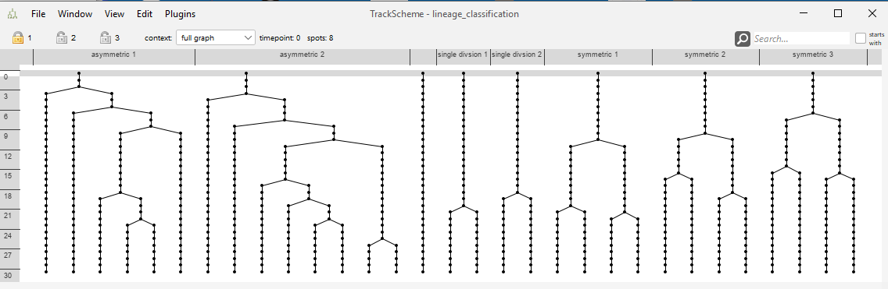
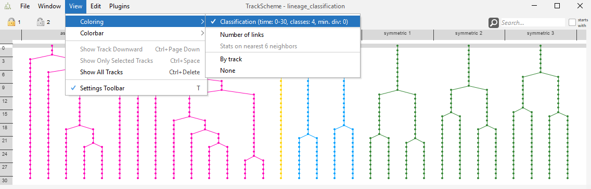

## Lineage Tree Classification

* This plugin is capable of grouping similar lineage trees together.
* The similarity of a pair of lineage trees is computed based on the Zhang edit distance for unordered
  trees ([Zhang, K. Algorithmica 15, 205–222, 1996](https://doi.org/10.1007/BF01975866)). This method captures the cost
  of the transformation of one tree into the other.
* The cost function applied for the tree edit distance uses the attribute branch spot duration, which is computed as a
  difference of time points between to subsequent divisions reflecting the start and the end of a spot's lifetime.
* Thus, the linage classification operates on Mastodon's branch graph.
* The Zhang unordered edit distance allows the following edit operations. The edit operations are defined in a way that
  they satisfy the constraints elaborated in section 3.1 ("Constrained Edit Distance Mappings") of the paper:

```
  Note: The prefix T may represent a node or a complete subtree. Nodes without this prefix are just nodes.
 
  1. Change label
 
        A         A'
       / \  -->  / \
      TB TC     TB TC
 
 
  2a: Delete subtree (opposite of 2b)
 
        A         A
       / \   -->  |
      TB TC       TB
 
  2b: Insert subtree (opposite of 2a)
 
        A          A
        |    -->  / \
        TB       TB TC
 
 
  3a: Delete one child of a node and delete the node itself (opposite of 3b)
 
        A             A
       / \   -->     / \
      B  TC         TD TC
     / \
    TD TE        (delete TE and B, TD becomes child of A)
 
  3b: Insert a node and insert one child at that node (opposite of 3a)
        A            A
       / \     -->  / \
      TB TC         D  TC
                   / \
                  TB TE       (insert D and TE, TB becomes child of D)
 
 
  4a: Delete node and delete its sibling subtree (opposite of 4b)
        A               A
       / \             / \
      B  TC   -->     TD TE
     / \
    TD TE            (Node B and its sibling subtree TC are deleted and the children
                      of B, namely TD and TE, become the children of A)
 
  4b: Insert node and insert a sibling subtree (opposite of 4a)
        A               A
       / \             / \
      TB TC   -->     D  TE
                     / \
                    TB TC       (Node D and its sibling TE are inserted,
                                 TB and TC become the children of D)
```

As an example, the following case explicitly does not fulfill the constraints mentioned in the paper:

```
 Delete a node without deleting one of its children
          A            A
         / \   -->   / | \
        B  TC      TD TE TC
       / \
      TD TE        (delete B, TD and TE become children of A and TC remains)
```

* A basic example of the tree edit distance:

```
Tree1
	                        node1(node_weight=13)
	               ┌──────────┴─────────────┐
	               │                        │
	             node2(node_weight=203)   node3(node_weight=203)
```

```
Tree2
	                        node1(node_weight=12)
	               ┌──────────┴─────────────┐
	               │                        │
	             node2(node_weight=227)   node3(node_weight=227)
	                             ┌──────────┴─────────────┐
	                           node4(node_weight=10)    node5(node_weight=10)
```

* Edit distance of 69, because:

    * one node has a difference of 1
    * two nodes have a difference of 24 each
    * two extra nodes are added with a weight of 10 each
    * 
* The tree edit distances are computed between all possible combinations of lineage trees leading to a two-dimensional
  matrix. The values in this matrix are considered to reflect similarities of lineage trees. Low tree edit distances
  represent a high similarity between a discrete pair of lineage trees.
* This similarity matrix is then used to perform
  an [agglomerative hierarchical clustering](https://en.wikipedia.org/wiki/Hierarchical_clustering) into a specifiable
  number of classes.

### Parameters

* Crop criterion:
    * Time point (default)
    * Number of spots
* Crop start
* Crop end
* Number of classes (minimum 2)
* Minimum number of divisions
* Similarity measures:
    1. (default) 
    2. 
    3. Zhang Tree Edit Distance as described in ([Zhang](https://doi.org/10.1007/BF01975866)).
* Linkage strategy for hierarchical clustering,
  cf. [linkage methods](https://en.wikipedia.org/wiki/Hierarchical_clustering#Cluster_Linkage)
    1. Average (default)
    2. Single
    3. Complete
* Feature:
    * Branch duration (default and currently only selectable feature)
* Show dendrogram of clustering

### Example

* Demo data: [Example data set](lineage_classification.mastodon)
    * The demo data does not contain any image data.
    * The spatial positions of the spots are randomly generated.
    * When opening the dataset, you should confirm that you open the project with dummy
      images. 
* The track scheme of the demo data containing 8 lineage tree in total. You may see that the "symmetric", the "
  asymmetric" and the "single division" trees look
  similar to each other, but dissimilar to the other
  trees. 
* The lineage classification dialog. 
* The resulting dendrogram. 
* The resulting tag set used for coloring the track
  scheme. 
* The resulting tag set used for coloring the track scheme branch
  view. 
