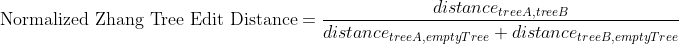
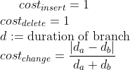
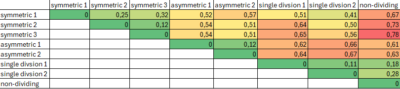

## Hierarchical Clustering of Lineage Trees

* This command is capable of grouping similar lineage trees together.
* It can be found in the menu under `Plugins > Hierarchical Clustering of Lineage Trees`.
* The linage clustering operates on Mastodon's branch graph.
* Lineage trees are considered similar, if they share a similar structure and thus represent a similar cell division
  pattern. The structure of a lineage tree is represented by the tree topology.
  This tree topology consists of the actual branching pattern and the cell lifetimes,
  i.e. the time points between two subsequent cell divisions.

### Zhang Tree Edit Distance

* The similarity of a pair of lineage trees is computed based on the Zhang edit distance for unordered
  trees ([Zhang, K. Algorithmica 15, 205–222, 1996](https://doi.org/10.1007/BF01975866)). This method captures the cost
  of the transformation of one tree into the other.
* The Zhang unordered edit distance allows the following edit operations. The edit operations are defined in a way that
  they satisfy the constraints elaborated in section 3.1 ("Constrained Edit Distance Mappings") of the
  paper: [Zhang, K. Algorithmica 15, 205–222, 1996](https://doi.org/10.1007/BF01975866)

```
  Note: The prefix T may represent a node or a complete subtree. Nodes without this prefix are just nodes.
 
  1. Change label
 
        A         A'
       / \  -->  / \
      TB TC     TB TC
 
 
  2a: Delete subtree (opposite of 2b)
 
        A         A
       / \   -->  |
      TB TC       TB
 
  2b: Insert subtree (opposite of 2a)
 
        A          A
        |    -->  / \
        TB       TB TC
 
 
  3a: Delete one child of a node and delete the node itself (opposite of 3b)
 
        A             A
       / \   -->     / \
      B  TC         TD TC
     / \
    TD TE        (delete TE and B, TD becomes child of A)
 
  3b: Insert a node and insert one child at that node (opposite of 3a)
        A            A
       / \     -->  / \
      TB TC         D  TC
                   / \
                  TB TE       (insert D and TE, TB becomes child of D)
 
 
  4a: Delete node and delete its sibling subtree (opposite of 4b)
        A               A
       / \             / \
      B  TC   -->     TD TE
     / \
    TD TE            (Node B and its sibling subtree TC are deleted and the children
                      of B, namely TD and TE, become the children of A)
 
  4b: Insert node and insert a sibling subtree (opposite of 4a)
        A               A
       / \             / \
      TB TC   -->     D  TE
                     / \
                    TB TC       (Node D and its sibling TE are inserted,
                                 TB and TC become the children of D)
```

As an example, the following case explicitly does not fulfill the constraints mentioned in the paper:

```
 Delete a node without deleting one of its children
          A            A
         / \   -->   / | \
        B  TC      TD TE TC
       / \
      TD TE        (delete B, TD and TE become children of A and TC remains)
```

* A basic example of the tree edit distance:

```
Tree1
	                        node1(node_weight=13)
	               ┌──────────┴─────────────┐
	               │                        │
	             node2(node_weight=203)   node3(node_weight=203)
```

```
Tree2
	                        node1(node_weight=12)
	               ┌──────────┴─────────────┐
	               │                        │
	             node2(node_weight=227)   node3(node_weight=227)
	                             ┌──────────┴─────────────┐
	                           node4(node_weight=10)    node5(node_weight=10)
```

* Edit distance of 69, because:
  * one node has a difference of 1 (13-12)
  * two nodes have a difference of 24 each (227-203 * 2)
  * two extra nodes are added with a weight of 10 each (10 * 2)
    * 

### Workflow

1. The similarity measure uses the attribute cell lifetime, which is computed as a difference of time points between two
   subsequent divisions. There are multiple ways to compute the similarity between two lineage trees based on this
   attribute:
2. The sum of the edit distances as shown in the basic example above. Individual differences in the cell lifetimes may
   be normalized by their sum (i.e. local normalization)
3. The sum of the edit distances as shown in the basic example above normalized by the maximum possible edit distances
   of the two trees (normalized zhang edit distance)
4. The sum of the edit distances normalized by the number of the involved nodes (per branch zhang edit distance)
5. The similarities are computed between all possible combinations of lineage trees leading to a two-dimensional
  similarity matrix. The values in this matrix are considered to reflect similarities of lineage trees. Low tree edit
  distances represent a high similarity between a discrete pair of lineage trees. This matrix is then used to perform
  an [Agglomerative Hierarchical Clustering](https://en.wikipedia.org/wiki/Hierarchical_clustering) into a specifiable
   number of groups.
6. For the clustering three
  different [linkage methods](https://en.wikipedia.org/wiki/Hierarchical_clustering#Cluster_Linkage) can be chosen.

### Parameters

* Crop criterion:
  * The criterion for cropping the lineage trees
  * Number of spots (default)
  * Time point
* Crop start
  * At which number of spots / time point (depending on the chose crop criterion) the analysis should start
* Crop end
  * At which number of spots / time point (depending on the chose crop criterion) the analysis should end
* Number of clusters
  * How many groups the lineage trees should be assigned to by the clustering
  * Must not be greater than the number of valid lineage trees
* Minimum number of divisions
  * The minimum number of divisions a lineage tree should have so that it is included in the analysis
* Similarity measures:
  1. (default) <sup>1,2</sup>
  2. <sup>1</sup>
  3. [Zhang](https://doi.org/10.1007/BF01975866) Tree Edit Distance<sup>1,2</sup>
  * <sup>1</sup>Local cost function: 
  * <sup>2</sup>Local cost function with normalization: 
* Linkage strategy for hierarchical clustering,
  cf. [linkage methods](https://en.wikipedia.org/wiki/Hierarchical_clustering#Cluster_Linkage)
    1. Average (default)
    2. Single
    3. Complete
* List of further projects
  * If you have multiple similar projects, you can add them here to get an average clustering taking all projects
    into account.
  * Mastodon projects can be added / removed using
    * "Add files..."
    * "Add folder content..."
    * "Remove selected"
    * "Clear list"
    * Drag and drop of files and folders
  * The name of the current open project is shown above the list. The current project is always included in the
    hierarchical clustering. It cannot be added to the list.
  * It is important that the names of the roots of lineages in all projects included in the hierarchical clustering are
    the same.
    Otherwise, the hierarchical clustering will not work.
  * The effect of adding further projects is that the similarity matrix is computed for each project separately and then
    averaged, resulting in a more robust hierarchical clustering.
* Add generated tags to further projects
  * If checked, the tags generated by the hierarchical clustering are also added to the further projects.
  * *Important note: this will write tags to these projects*. Consider making a backup of the further projects before
    running the hierarchical clustering, if you choose this option.
* Show dendrogram of hierarchical clustering of lineage trees
  * If checked, the dendrogram is shown after the hierarchical clustering
* Check validity of parameters
  * Press this button to check, if with the current parameters a hierarchical clustering is possible
  * If the parameters are invalid, a message will appear with the reason(s)
  * Possible reasons for invalid parameters:
    * The number of clusters is greater than the number of valid lineage trees
    * The crop start is greater than the crop end
    * The crop end is greater than the maximum number of spots / time points
    * Further projects that are included in the hierarchical clustering could not be found / opened

### Example

* Demo data: [Example data set](lineage_clustering.mastodon)
    * The demo data does not contain any image data.
    * The spatial positions of the spots are randomly generated.
    * When opening the dataset, you should confirm that you open the project with dummy
      images. 
* The track scheme of the demo data contains 8 lineage tree in total. You may see that the "symmetric", the "asymmetric"
  and the "single division" trees look similar to each other, but dissimilar to the remaining
  trees. 
* The hierarchical clustering dialog. Cf. section [parameters](#parameters) 
* Not visible to the user, a similarity matrix is computed based on the chosen similarity measure. For the demo data,
  the matrix looks like this. Highly similar trees have low distances in this matrix.
  * 
* The resulting dendrogram.
  * User can toggle on/off root labels, tags, clustering threshold and median of the tree edit distances.
  * If the option `Show tag labels` is checked, the tag set shown in the dendrogram can be chosen.
  * Export options for the dendrogram to SVG and PNG accessible via the context menu.
  * 
  * The result of the hierarchical clustering can be exported to a CSV file via the context menu. The exported file
    contains the root
    names of the lineage trees, the tag set value, the assigned group and the similarity score. The similarity score
    indicates how similar the lineage trees in this group are. The lower the score, the more similar the trees are.
  * 
* The resulting tag set may be used for coloring the track
  scheme. 
* The resulting tag set may be used for coloring the track scheme branch
  view. 
* The resulting tag set may be used for coloring the spots in the BigDataViewer. 
