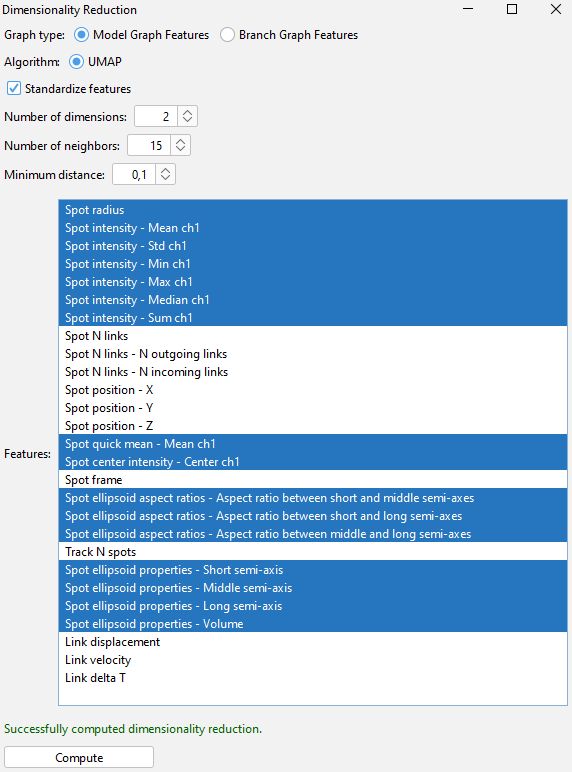
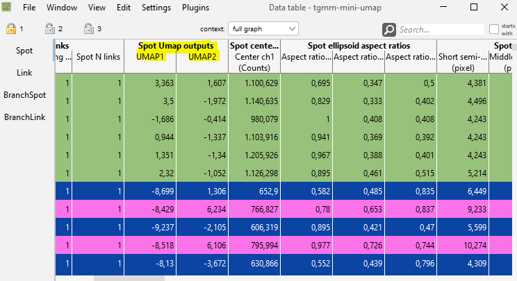
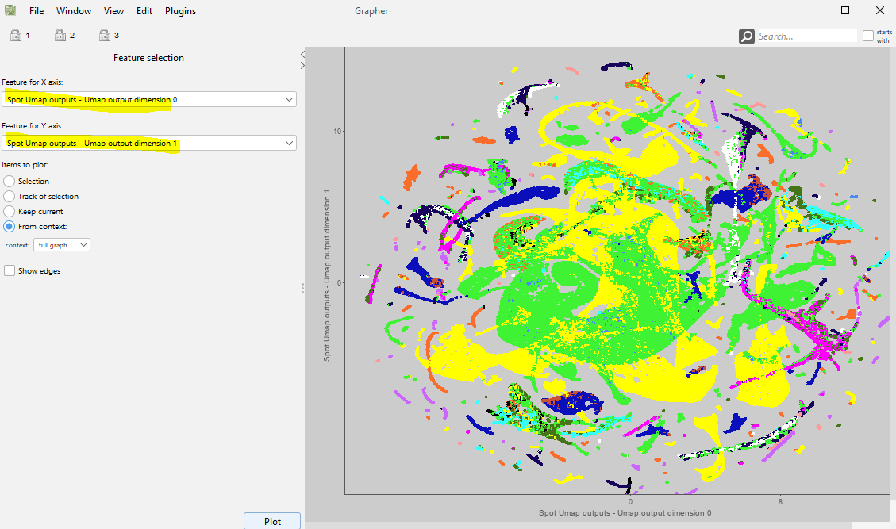

## Dimensionality reduction

For getting more insights into your data, you can reduce the dimensionality of the measurements, using this algorithm:

* [Uniform Manifold Approximation Projection (UMAP)](https://umap-learn.readthedocs.io/en/latest/)

To apply it to your data, use the menu `Plugins > Compute Feature > Dimensionality reduction > UMAP`.
Select the table whose features should be dimensionality reduced. Currently, the Spot and the BranchSpot table are
supported.
Next, select the feature + feature projections that should be dimensionality reduced.

By default, all measurements are selected in the box.

### Parameters

* Standardize: Whether to standardize the data before reducing the dimensionality. Standardization is recommended when
  the data has different scales / units.
  Further
  reading: [Standardization](https://scikit-learn.org/stable/modules/preprocessing.html#standardization-or-mean-removal-and-variance-scaling).
* Number of dimensions: The number of reduced dimensions to use. The default is 2, but 3 is also common.
  Further reading: [Number of Dimensions](https://umap-learn.readthedocs.io/en/latest/parameters.html#n-components).
* Number of neighbors: The size of the local neighborhood (in terms of number of neighboring sample points) used for
  manifold approximation.
  Larger values result in more global views of the manifold, while smaller values result in more local data being
  preserved.
  In general, it should be in the range 2 to 100.
  Further reading: [Number of Neighbors](https://umap-learn.readthedocs.io/en/latest/parameters.html#n-neighbors).
* Minimum distance: The minimum distance that points are allowed to be apart from each other in the low dimensional
  representation. This parameter controls how tightly UMAP is allowed to pack points together.
  Further reading: [Minimum Distance](https://umap-learn.readthedocs.io/en/latest/parameters.html#min-dist).

When you are done with the selection, click on `Compute UMAP`.
The resulting values will be added as additional columns to the selected table.

You can visualize the results using the `Grapher` View of Mastodon and selecting the newly added columns.

