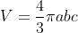
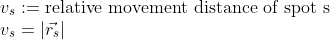
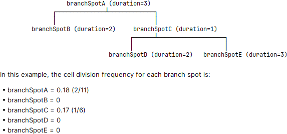

## Numerical Features added to Mastodon

### Spot Features

| **Feature name**             | **Projections**                                   | **Description**                                                                                                                                                                           | **Formula/Visualisation**                                                                                              |
|------------------------------|---------------------------------------------------|-------------------------------------------------------------------------------------------------------------------------------------------------------------------------------------------|------------------------------------------------------------------------------------------------------------------------|
| Spot Ellipsoid               | Short semi axes, Middle semi axis, Long semi axis | The ellipsoid semi axes in ascending order of length.                                                                                                                                     | The semi axes are computed applying the square root to the eigenvalues of the so-called covariance matrix of the spots |
|                              | Volume                                            | The volume of the ellipsoid.                                                                                                                                                              |                                                                                                |
| Spot Ellipsoid Aspect Ratios | Aspect ratio short to middle                      | The ratio between the short axis and middle axis.                                                                                                                                         |                                                                                       |
|                              | Aspect ratio short to long                        | The ratio between the short axis and long axis.                                                                                                                                           |                                                                                         |
|                              | Aspect ratio middle to long                       | The ratio between the middle axis and long axis.                                                                                                                                          |                                                                                        |
| Spot Branch ID               | _idem_                                            | The ID of the branch spot each spot belongs to.                                                                                                                                           |                                                                                                                        |
| Spot Relative Movement*      | x, y and z component                              | The x, y and z components of the movement distance of a spot relative to its `n` nearest neighbors. The number of neighbors to be considered can be specified by the users. Default is 5. |                                                                             |
|                              | distance                                          | The movement distance relative to `n` nearest neighbors.                                                                                                                                  |                                                                             |

### Branch Features

| **Feature name**                     | **Projections**      | **Description**                                                                                                                                                                                                                                                                         | **Formula/Visualisation**                                                                                   |
|--------------------------------------|----------------------|-----------------------------------------------------------------------------------------------------------------------------------------------------------------------------------------------------------------------------------------------------------------------------------------|-------------------------------------------------------------------------------------------------------------|
| Branch N Leaves                      | _idem_               | The total number of leaves of a branch spot in the whole track subtree of this branch spot.                                                                                                                                                                                             |                                                                                |
| Branch N Successors and Predecessors | _idem_               | Total number of successors and predecessors of a branch spot in the whole track subtree of this branch spot.                                                                                                                                                                            |                                                                |
| Branch Sinuosity                     | _idem_               | The sinuosity of a spot during its life cycle (cf. [Sinuosity](https://en.wikipedia.org/wiki/Sinuosity)), i.e. how much the track represented by the branch is curved. Values close to 1: almost straight movement. Values significantly higher than 1: winding or meandering movement. |                                                                      |
| Branch Average Movement              | _idem_               | The average movement per frame of a spot during its life cycle.                                                                                                                                                                                                                         |     e.g.:     |
| Branch Movement Direction            | _idem_               | The movement direction of a branch spot represented as a normalized directional vector pointing from the start (spot) position to the end (spot) position of the BranchSpot.                                                                                                            |                                                              |
| Branch Cell Division Frequency       | _idem_               | Number of cell divisions in the subtree rooted at each Branch-spot divided by total duration of branches in this sub-tree                                                                                                                                                               |                                                                  |
| Branch Relative Movement*            | x, y and z component | The x, y and z components of the average speed of a spot during its life cycle relative to its `n` nearest neighbors. The number of neighbors to be considered can be specified by the users. Default is 5.                                                                             |                                                              |
|                                      | average speed        | The average speed of a spot during its life cycle relative to its `n` nearest neighbors.                                                                                                                                                                                                |                                                              |

'*' The relative movement features cannot be called from the FeatureComputer directly. Instead they are computed via the
plugin menu: 
